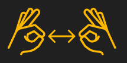

<!-- # CELESTIAL VIBE -->

  

 

## CONCEPT
### The Idea
Celestial Vibes was inspired by the idea of wanting to create music based on the behaviour of a system that can be found in nature. But not just any system, a system of individuals, part of a total, which therefore had a structural evolution based on the interactions between individuals.
The paradigm that most reflected this need is the *particle system*, and the best known one we can imagine and observe is right above us: the space.

Therefore, this project aims to find a way to make the laws of the universe interesting in a propaedeutic way. To do this, it creates a particle system made up of planets and exploits the interactions between them to compose generative music that can be enjoyed by the user in a way that brings them closer to understanding how gravitation works. 

The main purpose we see for this project is within a natural science museum or astronomical observatory, as a fixed educational-artistic installation suitable for anyone. The interaction paradigm is basically *didactic*, since the user can only assist to the output evolution of the system. Obviously for the moment this is only a prototype, that can be expanded with various interesting features to make the user experience even more immersive.

### The Physics
The physics of the system is described by the use of reactive agents with a personal goal, which react to the interpersonal interaction forces created by Newton's Law of Universal Gravitation.

$$F = G\ \frac{m_1 m_2}{r^2}$$

Where $F$ is the force, $G$ is the gravitational constant, $m_{1,2}$ are the particle masses and $r_{1,2}$ is the distance between the two particles.
Obviously this force needs to be computed to each couple of particles.

Once the force becomes too great, we see collisions between planets, which create bi- or tri-planetary systems. It should be noted, however, that in order to allow for musicality and engagement on the part of the user, the collisions are not entirely verisimilar but only happen due to a probability table and a complex process, linked to the musicality of the scale found. Doing so, the music becomes generative and pseudo-random but stays in any case binded to the musical scale chosen by the first collisions. 

Hence, only planets belonging to the chosen tonality will be able to form systems. 
What about planets not in the scale? Since they cannot form systems, they are used as triggers to launch arpeggiators.

### The Complexity Issue
As mentioned in the previous section, the gravitational pull between all planets must be calculated for <ins>each pair of planets</ins>. This implies that having $n$ planets brings the complexity of the algorithm to $O(n^2)$ very easily. This is not an issue when dealing with small number of planets, but in our case ($\approx 100-200$) planets the computational cost is high.

To reduce this complexity, we thought of using the [**Barnes-Hut algorithm**](http://arborjs.org/docs/barnes-hut).

  

 

This is a technique used in astrophysics and computer science to accelerate the computation of gravitational interactions in particle systems, such as simulations of celestial bodies within a stellar or galactic system. The main goal of this algorithm is to **reduce the complexity of the force computation** and it works as follows:

1. **Particle Organization**: Particles are organized into a hierarchical **tree structure** known as a quad/octree (depending on the problem's dimensions), where particles are grouped into increasingly larger clusters.

2. **Approximate Force Calculation**: The algorithm exploits an approximation and computes **recursively** gravitational forces between clusters of particles rather than between individual particles. 

3. **Complexity Reduction**: doing so the Barnes-Hut algorithm can significantly reduce the number of calculations required to determine gravitational forces. This leads to substantial computational savings, enabling larger and more complex simulations.

The application of this algorithm forms the beating heart of our system's physics, allowing us to reduce the computational complexity from $O(n^2)$ to $O(n\log(n))$.

## USER GUIDE
### Installation
Installation is quite simple as it involves downloading the folder containing the executables and running *src/dist/CelestialVibes.exe*.
This folder can be found [here](https://mega.nz/folder/ZzkxDZzb#dOnsJTfA-jYqzj6uCGyWCw).

As an important pre-requisite, however, you must have Supercollider installed in the recommended location "*C:\Program Files\Supercollider-3.12.2*". 

Also, the supercollider code uses an extension plugin that can be find in the file "*sc3-plugins-3.13.0-Windows-64bit.zip*" and needs to be extracted in the folder "*C:\ProgramData\SuperCollider\Extensions*", as said in the readme inside.

**IMPORTANT**: It is possible that Windows Defender will detect the programme as a virus and delete it, so it is recommended to add the downloaded folder to the exceptions. Furthermore, in newer versions of Windows, such as Windows 11, the boot of the Supercollider server may be delayed again due to the antivirus.

<ins>**THE WHOLE SYSTEM HAS BEEN TESTED AND BUILDED ON WINDOWS O.S.**</ins>

---
### Usage 
Once the program has been launched and finished loading, the initial screen will appear, suggesting to press 'space' 

  

 

The system is launched, the planets will begin to collide with each other, the musical scale will be created and the first sounds will be heard.

  

 

The system can now be navigated using simple gestures, one can control
* **ZOOM** : By showing pinched fingers and moving your hands closer together and further apart, you can control the zoom level of the system

  

 

* **ROTATION** : By showing the plucked fingers of the right hand only, it is possible to control the direction and level of rotation

  

 

* **PAN** : By performing the same gesture with the left hand alone, on the other hand, it is possible to control the pan 

  

 
    
* **MIXER** : Also the volume of the three main instruments can be modified, simply indicating with the right hand the number of the desired channel and pinching the thumb and index of the left hand and move it up and down like a fader. In the example below we're aiming to modify the volume of the *BASS*, that is positioned on the channel number two. 

  

 

* **USEFUL KEYS** : In addition to gesture control, there are also buttons that help to better understand the system.
These are:
   - **R** : system reset, resets all variables and recreates a new particle system from the beginning ready to be used 
   - **I** : info, provides brief information on how navigation works
  

    
  
 
   
   - **C** : chords, uses the PC navigation arrows to navigate the list of planetary systems created in order to understand how they were formed
  

    
  

* **MOUSE CLICK** : Clicking any mouse button it is possible to view the octree structure in the tridimensional space, and therefore the spacial density of the planets. It's also displayed with a yellow ray the planet which is the furthest from the center of the system.

  

## TOOLS
### Processing
[Processing](https://processing.org/) was used for the implementation of the graphics part. It offers a simplified Java-based programming language and a series of graphic libraries and predefined functions that simplify the creation of 2D and 3D graphics, animations, interactivity and much more. It is an excellent tool for those wishing to explore digital art, data visualisation or creative programming. 

In our case, it was crucial for the creation of the three-dimensional environment within which the planets are positioned. The use of the PVector class played a central role in describing all physics and the interactions between bodies, as it allows vectors to be created within the desired space.

---
### Supercollider
[SuperCollider](https://supercollider.github.io/) is an open-source audio programming environment and programming language. It is widely used for real-time sound synthesis, audio processing and music and sound composition. It offers a wide range of functionality for granular synthesis, additive synthesis, modulation and more. In addition, SuperCollider can be controlled in real time via commands, customised user interfaces or OSC messages. The power of SuperCollider also lies in the fact that it does not necessarily need an environment to be launched; once the script is completed, it can be launched from the command line for real time execution.

For the creation of this project all the audio part is handled by Supercollider, in what is a real virtual routing between the instruments and the mixer created in processing. We can divide the elements created into these 4 macro-categories:
- synths definition
- effects definition
- definition of audio buses, to create internal routing
- definition of the reaction to the stimulus provided by the OSC message

In addition, three instruments were created, each responding to a different stimulus from what is happening in the three-dimensional processing environment.
- **Bass** : creates a low-frequency drone with the root note corresponding to the scale chosen by the system. Every 6 bars, the drone plays two bars of the fifth degree of the scale an octave below.
- **Pad** : a long-note pad plays the notes played by the colliding systems.
- **Arp** : an arpeggiator is created that plays the notes of a system that has collided with a planet in an interesting way.

---
### Python + Mediapipe
[MediaPipe](https://developers.google.com/mediapipe) is an open-source library developed by Google that offers a number of tools and components for automatic media processing, in particular for analysing and tracking elements within images and videos. this library can be used primarily on the Web, Android or Python platforms. 

Our choice fell on the latter for obvious reasons, as this platform also allowed us to handle OSC communication in the local computer network. 

Of all the features offered by Mediapipe, we chose [Gesture Recognition](https://developers.google.com/mediapipe/solutions/vision/gesture_recognizer#get_started) as it allowed us to simultaneously understand what kind of gesture the user is making and also to track hands in real time. Both of these functionalities were obviously needed for the success of this project, as they were necessary for the desired level of interactivity with the user.

## PROTOCOLS
### OSC Messages
<!-- Scrivere brevemente cos'è e come l'abbiamo utilizzato e chi comunica con chi -->
All the communication between the three platforms is based on OSC messages, in the localhost network. Supercollider is only a "listener", Python is only a "sender" while Processing handles messages in both directions, like in the figure below.     
<!--  -->

  

The messages that depart from python are basically:
- gesture recognized
- position of hands in the frame
- exit from processing

The ones that depart instead from processing are:
- the root note
- the chord list
- the arpeggiator notes
- volumes of channels
- reset of the system
- exit from supercollider server

## Demo and Presentation links

[Presentation Link](https://prezi.com/view/eO7DVX5DXwY9fyZPt1vz/).

## The group
Alfieri Riccardo (riccardo.alfieri@mail.polimi.it) \
Cristofalo Marco (marco.cristofalo@mail.polimi.it) \
Donà Stefano (stefano2.dona@mail.polimi.it) \
Sgotto Silvio (silvio.sgotto@mail.polimi.it) 
